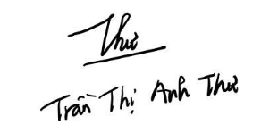



**CUỘC THI HUIT STARTUP LẦN THỨ VII NĂM 2026**

**CHỦ ĐỀ “ĐỔI MỚI SÁNG TẠO HƯỚNG TỚI MỤC TIÊU PHÁT TRIỂN BỀN VỮNG”** 

**CẤP THÀNH PHỐ**

**TÊN DỰ ÁN**
**\

**\

**LĨNH VỰC DỰ THI:** AI – Logistics

**NHÓM THỰC HIỆN:** 

1\. Trần Thị Anh Thư

2\. Đặng Bảo Việt

3\. Nguyễn Tuấn Vinh

4\. Trương Hoàng Nhã Anh

TP. Hồ Chí Minh, tháng 6 / 2026
2

**Thông tin vắn tắt về các thành viên tham gia dự án:**

1. Tên dự án: 	
1. Địa điểm triển khai dự án *(Dự kiến)*: 	
1. Thời điểm triển khai dự án *(Dự kiến)*: 	
1. Danh sách thành viên trong nhóm:

|**STT**|**Họ tên**|
**MSSV/**

**MSHV**
|**Lớp**|**Chuyên ngành**|**Trường**|**SĐT**|**Email**|**Ghi chú**|
| :-: | :-: | :-: | :-: | :-: | :-: | :-: | :-: | :-: |
|1|Trần Thị Anh Thư|
25210

03204
|
TH\_25D

MA12
|Marketing|Đại học Tài Chính - Marketing|0358134209|tranthianhthu.mar00@gmail.com|*Trưởng nhóm*|
|2|Đặng Bảo Việt|K235012067|K23501B|Luật Kinh Doanh|Trường Đại học Kinh tế - Luật|0327232460|dangbaoviet0804@gmail.com|*Thành viên*|
|3|Nguyễn Tuấn Vinh|SE204869||Công nghệ thông tin|Trường đại học FPT HCM|0943059948|tuanvinh2402@gmail.com|*Thành viên*|
|4|Trương Hoàng Nhã Anh|079307038700|7510605369361|Logistics và quản lý chuỗi cung ứng|Trường Đại học Giao thông Vận Tải TPHCM|0785881611|truonganhnha2007@gmail.com|*Thành viên*|

**Câu hỏi  dành cho các thành viên trong nhóm**

\- Bạn muốn mình làm nghề gì trong 10 năm tới ?

\- Nếu có 3 điều ước, Bạn ước mình có được những gì trong 10 năm tới ?

\- Hiện tại bạn đã có những điểm mạnh nào để biến ước mơ thành hiện thực ?
**\

**BẢN KẾ HOẠCH KINH DOANH** 

1. **Tóm tắt dự án**

**1. Mô tả sản phẩm/dịch vụ**

Dự án khởi nghiệp FreshTwin AI là một hệ thống công nghệ sâu (DeepTech) tích hợp toàn diện giữa phần cứng điều khiển thông minh và nền tảng phần mềm Trí tuệ nhân tạo (AI), được thiết kế chuyên biệt nhằm số hóa, thông minh hóa và tối ưu hóa toàn diện bối cảnh vận hành chuỗi cung ứng lạnh nông sản tại Việt Nam. Hiện tại, dự án đang ở giai đoạn sản phẩm khả dụng tối giản (MVP). Đội ngũ kỹ thuật đã hoàn thiện việc hiệu chuẩn các thuật toán động học nhiệt-sinh học, đồng thời thử nghiệm thành công thiết bị phần cứng thực địa, sẵn sàng đưa vào vận hành thương mại thử nghiệm.

Cấu trúc cốt lõi của FreshTwin AI vận hành theo một vòng lặp tự động hóa khép kín hoàn chỉnh, bao gồm ba tầng giải pháp công nghệ chính :

Mạng lưới cảm biến phân tầng (Sensor Grid/Mesh Network): Dự án sử dụng các hộp IoT Node không dây tích hợp vi điều khiển ESP32. Các nút này được bố trí chiến lược tại các "tử huyệt" của không gian bảo quản (như vùng rò rỉ nhiệt, góc khuất dòng khí đối lưu, hoặc lõi của đống hàng tích tụ khí ethylene) để đo đạc liên tục nhiệt độ, độ ẩm và khí sinh học.

Hệ thống Bản sao số (Digital Twin) và Trí tuệ nhân tạo: Dữ liệu thô từ mạng lưới cảm biến được truyền tải về đám mây để dựng lên một bản sao số của lô hàng. Tại đây, AI ứng dụng mô hình truyền nhiệt Lumped-parameter nâng cấp kết hợp phương trình hóa lý Arrhenius để ước lượng chính xác nhiệt độ lõi thực tế của sản phẩm, từ đó liên tục tính toán và cập nhật chỉ số Hạn sử dụng động (Dynamic Shelf Life - DSL) của từng pallet nông sản theo thời gian thực.

Cơ cấu chấp hành chủ động (Active Actuation): Vượt qua giới hạn của các hệ thống giám sát thụ động chỉ dừng lại ở mức cảnh báo, vi điều khiển ESP32 của FreshTwin AI kết nối trực tiếp với các rơ-le (relay) phần cứng tại kho bãi. Khi phát hiện nồng độ khí Ethylene (C2H4) hoặc nhiệt độ vượt ngưỡng an toàn, hệ thống sẽ tự động kích hoạt quạt thông gió hoặc tăng công suất dàn lạnh để tự "chữa bệnh" ngay lập tức mà không cần chờ con người can thiệp. Cuối cùng, phần mềm quản lý kho tự động điều phối xuất hàng theo nguyên lý Dynamic FEFO (Hàng có hạn sử dụng động ngắn nhất xuất trước).

**2. Lý do khách hàng chọn sản phẩm, giải pháp của dự án**

Khách hàng mục tiêu của dự án là các doanh nghiệp xuất khẩu nông sản, chủ trang trại lớn và các nhà cung cấp dịch vụ logistics bên thứ ba (3PL) tại Việt Nam. Họ ưu tiên lựa chọn giải pháp của FreshTwin AI nhờ vào những giá trị kinh tế và vận hành vượt trội dưới đây:

Chuyển đổi từ giám sát thụ động sang chủ động khắc phục sự cố: Các thiết bị ghi nhận nhiệt độ truyền thống (Data Logger) chỉ có vai trò ghi chép lại lịch sử nhiệt độ một cách thụ động, khiến doanh nghiệp hoàn toàn bất lực khi sự cố tăng nhiệt độ diễn ra trong quá trình vận chuyển. FreshTwin AI với cơ chế chấp hành chủ động thông qua rơ-le phần cứng giúp ngăn chặn và khắc phục rủi ro hư hỏng nông sản ngay tại thời điểm phát sinh sự cố.

Cắt giảm triệt để tỷ lệ hao hụt sau thu hoạch: Nông sản Việt Nam đang đối mặt với tỷ lệ tổn thất sau thu hoạch rất lớn, trung bình từ 25-30% (rau quả tươi có thể lên tới 45%). Nhờ việc theo dõi sát sao chỉ số chất lượng sinh hóa và can thiệp kịp thời, FreshTwin AI giúp bảo vệ toàn vẹn chất lượng nông sản, đưa tỷ lệ hao hụt thực tế xuống dưới mức 10%.

Tối ưu hóa quy trình xuất kho bằng thuật toán Dynamic FEFO: Thay vì áp dụng nguyên lý FIFO (nhập trước xuất trước) một cách máy móc khiến các lô hàng từng bị sốc nhiệt dọc đường bị thối hỏng trong kho, FreshTwin AI cung cấp giao diện quản lý trực quan giúp nhân viên kho lạnh thực hiện quy trình xuất kho theo nguyên tắc Dynamic FEFO (Hàng cận date động xuất trước). Điều này đảm bảo hiệu suất khai thác kho tối ưu và giảm thiểu rủi ro thối rữa cục bộ. (Xem lại các tiêu chuẩn thực tế của hàng cận date này)

Bài toán ROI vượt trội và cơ hội chuyển dịch phương thức vận tải: Chi phí vận chuyển bằng đường hàng không đắt gấp 5-8 lần so với đường biển. Bằng cách kéo dài tuổi thọ bảo quản tự nhiên của nông sản thêm 1,5 - 2 lần nhờ kiểm soát chuỗi lạnh chuẩn xác, FreshTwin AI mở ra cơ hội lớn cho doanh nghiệp xuất khẩu chuyển dịch lộ trình vận chuyển từ đường hàng không sang đường biển. Điều này giúp tiết kiệm tới 70% chi phí vận chuyển chặng xa, nâng cao khả năng cạnh tranh của nông sản Việt trên thị trường thế giới.

1. **Vai trò, tầm quan trọng của ý tưởng**

   **1. Tính độc đáo, sáng tạo**

FreshTwin AI là một giải pháp hoàn toàn mới, định hình lại bối cảnh công nghệ chuỗi cung ứng lạnh tại Việt Nam nhờ vào các giá trị sáng tạo khoa học và kỹ thuật cốt lõi chưa từng xuất hiện trên thị trường:

Mô hình Bản sao số nâng cấp tích hợp cơ chế thoát hơi nước tự nhiên của thực vật: Tính độc đáo về mặt khoa học của FreshTwin AI nằm ở mô hình toán học Lumped-parameter được tinh chỉnh sâu sắc để mô phỏng chính xác nhiệt độ lõi thực tế của nông sản. Khác với các mô hình lý thuyết thông thường bỏ qua các biến số sinh học phức tạp, công thức nhiệt động lực học của FreshTwin AI tích hợp trực tiếp tham số tốc độ tiêu hao nhiệt do quá trình thoát hơi nước tự nhiên:

Trong đó:

-  là khối lượng riêng của loại nông sản đặc trưng ().
-  là nhiệt dung riêng của nông sản ().
-  is thể tích của đơn vị đóng gói nông sản ().
-  là hệ số truyền nhiệt đối lưu của môi trường kho/container ().
-  là diện tích bề mặt tiếp xúc nhiệt của nông sản ().
-  là nhiệt độ không khí xung quanh biến đổi theo thời gian (![ref1]).
- ![ref2] là nhiệt độ lõi thực tế của nông sản cần ước lượng (![ref1]).
- là tốc độ sinh nhiệt do hoạt động hô hấp nội tại của thực vật (W).
- ![ref3] là tốc độ tiêu hao nhiệt do quá trình thoát hơi nước tự nhiên của nông sản (W).

Việc bổ sung biến số ![ref4] mang tính quyết định về độ chính xác lý thuyết vì nông sản vốn chứa 80-90% là nước. Khi nằm trong môi trường không khí khô của kho lạnh, hiện tượng thoát hơi nước trên vỏ trái cây thực chất là một quá trình thu nhiệt tự nhiên làm mát nông sản. Việc tính toán thêm tham số này giúp giải thuật AI loại bỏ hoàn toàn các sai lệch nhiệt độ, mang lại kết quả ước lượng trạng thái vật lý thực tế đạt độ tin cậy vượt trội, loại bỏ các kịch bản bị giám khảo phản biện.

Ứng dụng phương trình hóa lý Arrhenius để dự báo Hạn sử dụng động (DSL): Trong khi các giải pháp công nghệ hiện tại trên thị trường thường áp dụng sai lệch các mô hình vi sinh vật Baranyi-Roberts (vốn chỉ phù hợp cho sự phát triển của vi khuẩn trên bề mặt thịt hoặc thủy sản đông lạnh), FreshTwin AI đi tiên phong trong việc ứng dụng phương trình hóa lý Arrhenius để mô tả chính xác quá trình suy giảm chất lượng sinh hóa tự nhiên của các loại thực vật sau thu hoạch:

Trong đó:

-  là chỉ số chất lượng sinh hóa hiện tại của nông sản (như độ cứng vỏ, hàm lượng acid, hoặc tỷ lệ biến màu sinh lý).
-  là hằng số tốc độ phản ứng suy giảm cơ bản.
-  là năng lượng hoạt hóa đặc trưng cho từng chủng loại nông sản ().

\

-  là hằng số khí lý tưởng ().
- ![ref2]là chuỗi dữ liệu nhiệt độ lõi thực tế do mô hình Bản sao số cung cấp (![ref1]).
-  là bậc phản ứng động học đặc trưng cho quá trình phân hủy hóa lý.

Sự kết hợp này cho phép AI dự báo chính xác thời điểm nông sản đạt độ chín tối ưu hoặc bắt đầu xuất hiện hiện tượng nẫu hỏng dựa trên lịch sử nhiệt độ tích lũy thực tế của chính pallet đó, thay vì gán nhãn ngày hết hạn cố định (Static Expiry) kém linh hoạt.

Kiến trúc điều khiển tự động khép kín "Cảm biến - Tính toán - Chấp hành" giúp tự chữa bệnh: Điểm độc đáo vượt trội nhất của FreshTwin AI so với các đối thủ trên thị trường là khả năng khép kín vòng lặp tự động hóa. Không dừng lại ở việc hiển thị đồ thị nhiệt độ vô hồn trên màn hình điều khiển, FreshTwin AI liên kết trực tiếp kết quả phân tích của AI với cơ sở hạ tầng vật lý của nhà kho thông qua các mạch điều khiển ESP32 và hệ thống rơ-le tự động. Hệ thống có khả năng tự động thực hiện các hành động can thiệp vật lý (như thông gió, tăng cường luồng khí lạnh cục bộ) ngay khi phát hiện nồng độ khí C2H4 tăng cao hoặc có hiện tượng rò rỉ nhiệt. Đây là giải pháp "tự chữa bệnh" (self-healing cold chain) đầu tiên được thiết kế và áp dụng thực tế tại thị trường logistics Việt Nam.

**2. Năng lực tổ chức thực hiện** 

|Thành viên|Vai trò|
| - | - |
|Trần Thị Anh Thư|Project Lead - Product & Marketing Lead|
|Đặng Bảo Việt|R & D Lead|
|Nguyễn Tuấn Vinh|AI & Digital Lead|
|Trương Hoàng Nhã Anh|Logistics Lead|

**3. Hiệu quả kinh tế và tác động xã hội**

Nông sản là một trong những ngành xuất khẩu chủ lực của Việt Nam, tuy nhiên tình trạng hư hỏng trong quá trình bảo quản và vận chuyển vẫn đang gây thiệt hại lớn cho doanh nghiệp và người nông dân. Nguyên nhân chủ yếu đến từ việc nhiệt độ, độ ẩm và khí sinh học trong kho lạnh hoặc container không được kiểm soát chặt chẽ. Bên cạnh đó, nhiều đơn vị phân phối hay cụ thể hơn có tới 73,8% nhà phân phối nông sản chưa được trang bị đầy đủ kiến thức và công nghệ quản lý chuỗi lạnh. 

Chỉ cần xảy ra sự cố mất lạnh hoặc biến động nhiệt độ trong thời gian ngắn cũng có thể làm giảm chất lượng, rút ngắn thời gian bảo quản và dẫn đến hư hỏng hàng hóa trước khi đến tay người tiêu dùng. Trước thực trạng đó, FreshTwin AI được phát triển nhằm ứng dụng công nghệ IoT, Digital Twin và Trí tuệ nhân tạo để giám sát liên tục tình trạng nông sản, dự báo hạn sử dụng động theo thời gian thực và hỗ trợ tối ưu hóa vận hành chuỗi lạnh, góp phần giảm hao hụt, nâng cao chất lượng nông sản và tăng sức cạnh tranh cho hàng hóa Việt Nam trên thị trường quốc tế. 

Có thể nói rằng FreshTwin AI không đơn thuần là một giải pháp cải tiến quy trình logistics, mà còn là một ý tưởng đột phá tạo ra giá trị kinh tế, môi trường và xã hội thông qua việc phát hiện sớm vấn đề cấp thiết, đồng thời giải quyết nhằm “giữ sự sống” cho nông sản, tối ưu chuỗi lạnh và nâng cao năng lực cạnh tranh của thị trường nông sản Việt Nam. 

Nhờ vào sự nhạy cảm đối với các yếu tố trong môi trường kín như nhiệt độ, độ ẩm và khí sinh học Ethylene, FreshTwin AI giúp sớm phát hiện sớm đứt gãy chuỗi lạnh và hỗ trợ bật quạt thông gió hoặc tăng công suất dàn lạnh từ đó giảm tỷ lệ hư hỏng và thất thoát nông sản. Điều này góp phần bảo vệ giá trị kinh tế cho các bên liên quan. Việc đảm bảo tính thương mại cho nông sản xuyên suốt quá trình vận chuyển sẽ góp phần giúp mặt hàng đáp ứng được tiêu chuẩn khắt khe của các thị trường xuất khẩu như EU, Mỹ, Nhật Bản,...

Việc giảm thiểu tình trạng hư hỏng nông sản, do các yếu tố môi trường trong container, làm trái cây nhanh chín hơn dự tính. Dẫn đến tình trạng lây lan thối rữa cục bộ, ảnh hưởng nặng nề đến chất lượng  của toàn bộ lô hàng hoa quả đang có trong container. Khắc phục được vấn đề trên cũng đồng nghĩa với việc giảm lãng phí tài nguyên đất, nước, phân bón và năng lượng đã sử dụng để sản xuất ra các lô hàng hoa quả. 

` `Hệ thống FreshTwin AI ngoài việc mang lại lợi ích kinh tế, thì còn đóng góp trực tiếp vào nhiều tiêu chí trong 17 tiêu chí phát triển bền vững của Liên hợp quốc đang thực hiện ở Việt Nam. Đầu tiên có thể kể đến là mục tiêu xóa đói giảm nghèo, chính nhờ vào sự phát hiện kịp thời của hệ thống làm giảm thất thoát chất lượng hoa quả mà sản lượng đạt tiêu chuẩn đến tay người tiêu dùng tăng lên, góp phần nâng cao hiệu suất nông nghiệp và gia tăng thu nhập cho người nông dân.

Tiếp theo là tiêu chí công nghiệp, sáng tạo và phát triển hạ tầng. Dự án áp dụng các công nghệ tiên tiến như IoT, trí tuệ nhân tạo và Digital Twin vào hoạt động logistics nông nghiệp, vốn đang gặp nhiều vấn đề trong việc đảm bảo chất lượng đạt chuẩn của nông sản khi phải vận chuyển khoảng thời gian dài. Đây là giải pháp thúc đẩy chuyển đổi số, hiện đại hóa hạ tầng logistics và nâng cao năng lực đổi mới sáng tạo trong chuỗi cung ứng tại Việt Nam.

Kế đến là tiêu chí tiêu thụ và sản xuất có trách nhiệm, một trong những mục tiêu quan trọng nhất mà SDG 12 hướng đến là giảm lãng phí thực phẩm. FreshTwin AI một “trợ lý” đáng tin cậy liên tục dự báo chính xác hạn sử dụng động của từng thùng hàng, phát hiện sớm những bất thường và tự động xuất kho theo nguyên lý hàng cận date tự động xuất trước (Dynamic FEFO) .

Từ những thông tin trên, có thể thấy dự án FreshTwin AI được ra đời và phát triển nhằm giải quy

ết trực tiếp “nỗi đau” lớn nhất trong chuỗi cung ứng lạnh vận chuyển nông sản hiện nay. Đó là tình trạng hư hỏng hàng hóa do nhiệt độ, độ ẩm và khí sinh học Ethylene biến động trong quá trình bảo quản và vận chuyển. Dự án khai thác, triển khai và ứng dụng mạng lưới cảm biến không dây, công nghệ Digital Twin và trí tuệ nhân tạo (AI) nhằm cập nhật liên tục chỉ số hạn sử dụng của những lô hàng hiện diện trong container, đưa ra những biện pháp kịp thời. Cuối cùng hỗ trợ doanh nghiệp điều phối xuất kho theo nguyên tắc FEFO. 

Căn cứ vào những gì mà FreshTwin AI làm được, có thể đưa ra nhận định rằng đây là một dự án sở hữu tiềm năng tăng trưởng và nhân rộng mạnh mẽ nhờ vào mô hình công nghệ số dễ triển khai, không phụ thuộc vào việc đầu tư hạ tầng vật lý quy mô lớn, Dự án có thể mở rộng từ trái cây tươi sang thủy sản, hoa tươi, thực phẩm đông lạnh,... Về lâu dài khi tích lũy đủ nhiều dữ liệu, thuật toán AI sẽ ngày càng chính xác hơn tạo nên lợi thế cạnh tranh bền vững và nhân rộng ra thị trường khu vực Đông Nam Á, nơi đang đối mặt với thách thức tương tự về chuỗi cung ứng lạnh.

**4. Thị trường tiềm năng**

\- Sản phẩm FreshTwin AI mang lại giá trị kinh tế và vận hành vượt trội cho các doanh nghiệp xuất nhập khẩu trái cây, chủ kho vận logistics lạnh và các hợp tác xã nông nghiệp công nghệ cao. Bằng cách thay thế các giải pháp giám sát thụ động thông thường bằng mạng lưới cảm biến phân tầng thông minh và cơ chế tự động hóa khép kín, hệ thống giúp họ tiết kiệm tối đa chi phí thiết bị, loại bỏ rủi ro hư hỏng hàng hóa và tối ưu hóa quy trình điều phối kho theo thời gian thực. Nhờ vậy, chuỗi cung ứng được vận hành trơn tru hơn, đồng thời đảm bảo nông sản khi đến tay các đối tác thu mua như siêu thị, chuỗi bán lẻ hay người tiêu dùng cuối cùng luôn giữ được chất lượng tươi ngon và kéo dài thời gian sử dụng động.  

\- Đối tượng khách hàng quan trọng nhất của giải pháp công nghệ B2B này chính là các chủ doanh nghiệp, giám đốc logistics hoặc quản lý chuỗi cung ứng - những người có thu nhập cao, tư duy hiện đại và nắm quyền quyết định đầu tư công nghệ tại các doanh nghiệp có quy mô vừa và lớn. Họ là những người trực tiếp đối mặt với áp lực giảm tỷ lệ hao hụt nông sản và thường sống, làm việc tại các vùng trọng điểm nông nghiệp (nơi tập trung các tổng kho bảo quản, vùng nguyên liệu xuất khẩu) hoặc tại các trung tâm logistics, thành phố lớn có hệ thống cảng biển và kho lạnh trung chuyển sầm uất.

**5. Ứng dụng công nghệ**

Dự án FreshTwin AI là một hệ thống công nghệ sâu (DeepTech) vận hành theo một vòng lặp tự động hóa khép kín, tích hợp toàn diện giữa phần cứng điều khiển và nền tảng Trí tuệ nhân tạo (AI). Khác với các hệ thống giám sát thụ động thông thường, giải pháp của chúng tôi giải quyết bài toán vận hành kho lạnh dựa trên ba nền tảng công nghệ cốt lõi:

Thứ nhất, thu thập dữ liệu bằng Mạng lưới cảm biến phân tầng (Sensor Grid/Mesh Network). Việc đính kèm cảm biến lên từng thùng hàng là không khả thi về mặt thương mại do chi phí thiết bị và phí duy trì mạng rất lớn. Do đó, FreshTwin AI ứng dụng mạng lưới các hộp IoT Node tích hợp vi điều khiển ESP32. Các thiết bị này được đặt tại các "tử huyệt" của không gian bảo quản, cụ thể là các góc khuất rò rỉ nhiệt hoặc lõi đống hàng tích tụ khí nẫu hỏng Ethylene (C2H4). Từ dữ liệu đo đạc tại các "điểm chốt" này, thuật toán sẽ nội suy không gian để vẽ ra bản đồ nhiệt và khí chính xác cho toàn bộ lô hàng.

Thứ hai, dự báo Hạn sử dụng động (DSL) bằng thuật toán AI. Toàn bộ dữ liệu thô sẽ lập tức được truyền về hệ thống xử lý trung tâm. Thay vì áp dụng phương pháp gán nhãn ngày hết hạn cố định (Static Expiry) kém linh hoạt , AI của dự án ứng dụng phương trình động học hóa lý Arrhenius để liên tục cập nhật tuổi thọ của nông sản dựa trên lịch sử nhiệt độ tích lũy. Đặc biệt, thuật toán đã được tối ưu hóa để tính toán thêm sự tác động của quá trình bay hơi nước bề mặt—một quá trình thu nhiệt tự nhiên làm mát trái cây. Điều này giúp AI đánh giá chính xác nhiệt độ lõi thực tế và đưa ra chỉ số Hạn sử dụng động (Dynamic Shelf Life - DSL) có độ tin cậy cao.

Thứ ba, "Cơ cấu chấp hành" (Active Actuation) tạo nên khả năng "tự chữa bệnh". Điểm đột phá làm nên sự khác biệt của FreshTwin AI là khả năng can thiệp phần cứng tự động, khắc phục hoàn toàn điểm yếu của các hệ thống chỉ dừng lại ở mức cảnh báo. Khi phát hiện nồng độ khí C2H4 hoặc nhiệt độ vọt lên ngưỡng nguy hiểm , vi điều khiển (ESP32) sẽ trực tiếp kích hoạt các rơ-le (relay) để bật quạt thông gió hoặc tăng công suất dàn lạnh. Nhờ cơ chế này, hệ thống tự động "chữa bệnh" ngay tại kho mà không cần chờ con người thao tác.

Cuối cùng, dựa trên chỉ số DSL liên tục được cập nhật, phần mềm quản lý sẽ tự động điều phối ưu tiên xuất kho theo nguyên lý Dynamic FEFO (hàng cận date động xuất trước), giúp doanh nghiệp triệt tiêu hoàn toàn rủi ro thối rữa cục bộ.

**6. Mô hình kinh doanh** 

Trình bày dưới dạng **Business Model Canvas** *(Lưu ý: chỉ điền những thông tin tối giản, cốt lõi của dự án)*

|
**ĐỐI TÁC CHÍNH**

** Nhà cung ứng linh kiện: Đơn vị cấp chip vi điều khiển, cảm biến khí Ethylene /nhiệt độ/độ ẩm.

`  `Doanh nghiệp hạ tầng: Đơn vị thi công kho lạnh, vỏ container lạnh..
|
**HOẠT ĐỘNG CHÍNH**

** R&D Công nghệ: Tối ưu thuật toán AI (Arrhenius kết hợp biến thoát hơi nước) và giải thuật nội suy.  

Sản xuất phần cứng: Lắp ráp, cấu hình thiết bị IoT Node.  

Tích hợp hệ thống: Lắp đặt tại kho và đồng bộ phần mềm quản lý xuất kho (Dynamic FEFO).
|
**GIẢI PHÁP GIÁ TRỊ**

** Giảm tổn thất: Triệt tiêu rủi ro thối rữa nông sản sau thu hoạch. 

` `Tự "chữa bệnh" chủ động: Kích hoạt rơ-le (quạt, dàn lạnh) xử lý sự cố tức thời mà không cần con người.  

AI dự báo DSL: Tính toán nhiệt độ lõi và cập nhật Hạn sử dụng động theo thời gian thực (phương trình Arrhenius nâng cao).  

Tối ưu chi phí: Mạng lưới cảm biến phân tầng (Sensor Grid) tại các "tử huyệt" giúp giảm 85% chi phí thiết bị so với gắn đại trà từng thùng.
|
**QUAN HỆ KHÁCH HÀNG**

** Thiết kế bản đồ điểm chốt cảm biến riêng cho từng kết cấu kho hàng.  

Hệ thống tự động hóa khép kín: Cảnh báo và tự động điều hành cơ cấu chấp hành.
|
**PHÂN KHÚC KHÁCH HÀNG**

** Doanh nghiệp xuất nhập khẩu: Các công ty kinh doanh trái cây, nông sản tươi.  

Chủ kho vận: Đơn vị vận hành chuỗi kho lạnh, container lạnh logistics. 

` `Hợp tác xã: Các đơn vị nông nghiệp công nghệ cao hướng đến xuất khẩu.
||||
| :-: | :-: | :-: | :-: | :-: | :- | :- | :- |
||
**TÀI NGUYÊN CHÍNH**

** Công nghệ độc quyền: Thuật toán nội suy không gian và mô hình toán lý Digital Twin.

Nhân sự: Sinh viên trường đại học TP Hồ Chí Minh
||

**CÁC KÊNH THÔNG TIN VÀ KÊNH PHÂN PHỐI**

** Bán hàng trực tiếp (B2B Direct Sales): Tiếp cận trực tiếp giám đốc logistics, quản lý chuỗi cung ứng.

Triển lãm & Hội chợ: Tham gia các sự kiện công nghệ nông nghiệp và logistics.
|||||
|
**CẤU TRÚC CHI PHÍ**

** Chi phí R&D: Lương nhân sự phát triển AI, phần cứng và nền tảng Cloud.

Chi phí sản xuất: Giá vốn linh kiện điện tử và thiết bị chấp hành.  

Chi phí vận hành: Hạ tầng server lưu trữ và xử lý dữ liệu..
|

**DÒNG DOANH THU**

** Bán phần cứng (CAPEX): Doanh thu từ thiết bị IoT Node (ESP32, cảm biến, mạch relay).  

Phí phần mềm (SaaS - OPEX): Phí bản quyền nền tảng Cloud Bản sao số (Digital Twin) và AI theo tháng/năm.
|||||||

**

1. **Xác định sứ mạng, tầm nhìn, mục tiêu, giá trị cốt lõi của dự án**

\- Sứ mạng: Số hóa và tự động hóa quy trình bảo quản nông sản sau thu hoạch bằng công nghệ Bản sao số (Digital Twin) và AI, nhằm triệt tiêu sự lãng phí, tối ưu hóa giá trị chuỗi cung ứng lạnh và bảo vệ thành quả của người nông dân.

\- Tầm nhìn: Trở thành nền tảng công nghệ Bản sao số dẫn đầu tại Việt Nam và khu vực trong lĩnh vực logistics lạnh thông minh, định hình lại tiêu chuẩn quản lý kho vận nông sản bằng giải pháp tự động hóa khép kín và khả thi về mặt thương mại.

\- Mục tiêu: Ngắn hạn (1-2 năm): Hoàn thiện và đóng gói giải pháp phần cứng mạng lưới cảm biến phân tầng (Sensor Grid) kết hợp thuật toán AI dự báo hạn sử dụng động (DSL); triển khai thử nghiệm thành công tại 3-5 hệ thống kho lạnh/container nông sản lớn.  Dài hạn (3-5 năm): Thương mại hóa diện rộng trên thị trường logistics B2B, giúp các đối tác giảm tỷ lệ hao hụt nông sản xuống dưới 5% và tối ưu chi phí vận hành kho thông qua chu trình điều phối Dynamic FEFO.  

\- Giá trị cốt lõi: Không dừng lại ở cảnh báo, hệ thống luôn chủ động can thiệp phần cứng để tự "chữa bệnh" và bảo vệ hàng hóa tức thời. Tin cậy trong từng dự báo nhờ sự kết hợp chặt chẽ giữa trí tuệ nhân tạo và các mô hình toán lý chuyên sâu. Luôn hướng đến tính khả thi thương mại bằng cách tối giản chi phí đầu tư thiết bị cho khách hàng.

**D. Kết quả nghiên cứu thị trường**

**(đối với các đội thi vào chung kết)**

\- Mục tiêu nghiên cứu

\- Phạm vi nghiên cứu (Khu vực địa lý, thời gian thực hiện).

\- Kết quả nghiên cứu thị trường

**E. Kế hoạch sản xuất, kinh doanh**

**1. Kế hoạch Marketing**

***1.1 Kế hoạch truyền thông tiếp cận khách hàng***

***Kênh tiếp cận trực tiếp (Trọng tâm B2B)***

- ***Hội chợ triển lãm chuyên ngành:** Tham gia trực tiếp Triển lãm Logistics Quốc tế (VILOG), Triển lãm Công nghệ Nông nghiệp để tiếp cận Giám đốc chuỗi cung ứng, Giám đốc Logistics.*
- ***Truyền thông trực tiếp (Direct Marketing):** Chào hàng và gửi hồ sơ năng lực (Profile) trực tiếp đến các chủ doanh nghiệp xuất nhập khẩu và chủ kho lạnh lớn.*
- ***Hiệp hội chuyên ngành:** Đăng bài giải pháp trên kênh truyền thông của Hiệp hội Rau quả Việt Nam (VINAFRUIT) và Hiệp hội Logistics (VLA).*

***Thông điệp và Công cụ độc đáo***

- ***Thông điệp khác biệt:** "Hệ thống duy nhất tự động can thiệp phần cứng để tự chữa bệnh cho kho hàng, cứu vớt nông sản sốc nhiệt tức thời mà không cần chờ con người."*
- ***Công cụ truyền thông:** Website giới thiệu giải pháp; Video Case-study quay thực tế tại kho thử nghiệm chứng minh hiệu quả giảm hao hụt; Sách trắng (Whitepaper) chứng minh bài toán giảm 85% chi phí thiết bị nhờ mạng lưới cảm biến phân tầng (Sensor Grid).*

***Thông điệp và Công cụ độc đáo***

- ***Thông điệp khác biệt:** "Hệ thống duy nhất tự động can thiệp phần cứng để tự chữa bệnh cho kho hàng, cứu vớt nông sản sốc nhiệt tức thời mà không cần chờ con người."*
- ***Công cụ truyền thông:** Website giới thiệu giải pháp; Video Case-study quay thực tế tại kho thử nghiệm chứng minh hiệu quả giảm hao hụt; Sách trắng (Whitepaper) chứng minh bài toán giảm 85% chi phí thiết bị nhờ mạng lưới cảm biến phân tầng (Sensor Grid).*

  ***1.2 Chiến lược bán hàng và Kênh phân phối***

  ***Quy trình bán hàng (Trực tiếp)***

***Khảo sát:** Kỹ sư đến tận kho của khách hàng, xác định các "tử huyệt" (góc khuất nhiệt, lõi tích tụ khí $C\_2H\_4$).*

***Thử nghiệm (PoC):** Lắp đặt miễn phí một cụm Sensor Grid nhỏ trong 1 tháng để khách hàng đối chiếu kết quả dự báo hạn sử dụng động (DSL) của AI với thực tế.*

***Chốt hợp đồng:** Bán thiết bị phần cứng (Mạch ESP32, Relay) và ký gói phần mềm quản lý (SaaS) thu phí định kỳ theo năm.*

***Kênh phân phối chiến lược (Gián tiếp)***

***Nhà thầu xây dựng kho lạnh:** Hợp tác với các đơn vị thi công, lắp đặt vỏ kho lạnh để tích hợp FreshTwin AI thành một tiện ích công nghệ cao cấp (Add-on) bán kèm cho khách hàng của họ.*

***Đơn vị cho thuê container lạnh:** Tích hợp sẵn hệ thống mạch điều khiển của FreshTwin AI vào thùng container để cung cấp giải pháp vận chuyển thông minh trọn gói cho các doanh nghiệp xuất khẩu đường biển.*

**2. Kế hoạch sản xuất sản phẩm hoặc dịch vụ**

\- Làm thế nào làm ra được sản phẩm dịch vụ?

\- Quy trình sản xuất

\- Máy móc thiết bị công nghệ phục vụ sản xuất, kinh doanh…

\- Quy trình dịch vụ

**3. Kế hoạch tổ chức quản lý**

\- Để triển khai dự án vào thực tế, dự án cần đội ngũ nhân sự như thế nào? Số lượng, trình độ chuyên môn? 

\- Lộ trình phát triển nhân sự?

\- Loại hình doanh nghiệp (dự kiến), cơ cấu tổ chức nhân sự, chức năng, nhiệm vụ của mỗi vị trí nhân sự…

**4.  Kế hoạch tài chính**

\- Dự kiến tổng kinh phí thực hiện dự án là bao nhiêu, trong đó dự kiến nguồn vốn huy động từ đâu? (từ gia đình, đồng nghiệp, các nguồn quỹ đầu tư hay vay ngân hàng?)

\- Dự kiến chi phí, doanh thu, lợi nhuận

\- Khả năng hoàn vốn? thời điểm hoàn vốn và khả năng thu lợi nhuận của dự án?

**5. Kế hoạch quản trị rủi ro**

Dự kiến những rủi ro và giải pháp khắc phục

**6. Các nguồn lực khác hỗ trợ thực hiện dự án**

\-  Dự án đã có doanh nghiệp nào tư vấn hỗ trợ hay chưa? Đã từng đạt giải ở cuộc thi nào hay chưa?

\-  Đánh giá nguồn nhân lực, tính sẵn sàng tham gia của đội nhóm?

\-  Ý tưởng dự án có phải là các công trình nghiên cứu khoa học? sáng kiến khoa học? có khả năng được bảo hộ?

\- Các đối tác có thể hỗ trợ triển khai dự án (những tổ chức, cá nhân nào có thể giúp bạn về kinh nghiệm, tài chính, tư vấn chuyên môn…).

**7. Tính khả thi**

\- Khẳng định lại năng lực của đội ngũ nhân sự có kiến thức, có kỹ năng và thái độ để triển khai ý tưởng vào thực tế

\- Khẳng định lại giá trị của ý tưởng có thể đem đến cho địa phương, cho xã hội của ý tưởng…

\- Khẳng định lại tính khả thi của việc huy động nguồn lực tài chính và thời gian, địa điểm triển khai dự án.

**F. Cam kết của nhóm dự thi**

\- Hồ sơ dự thi, thông tin và tài liệu minh chứng kèm theo là trung thực, chính xác và hợp pháp.

\- Dự án tham gia thuộc quyền sử dụng hợp pháp của nhóm dự thi; không sao chép, không vi phạm quyền sở hữu trí tuệ và không thuộc đối tượng đang có tranh chấp.

\- Các thành viên trong nhóm đã thống nhất về nội dung dự thi, quyền đại diện của nhóm trưởng và trách nhiệm trong quá trình tham gia cuộc thi.

\- Nhóm dự thi tự chịu trách nhiệm trước Ban Tổ chức và trước pháp luật nếu phát sinh khiếu nại, tranh chấp hoặc vi phạm liên quan đến dự án dự thi.

\- Nhóm dự thi cam kết chấp hành đầy đủ thể lệ, kế hoạch và các quy định của Ban Tổ chức.

TP. Hồ Chí Minh, ngày ….. tháng ….. năm 2026

`							`**ĐẠI DIỆN NHÓM DỰ THI**

							*(Ký, ghi rõ họ tên)*

**Lưu ý:** Bài dự thi được trình bày bằng tiếng Việt, tối đa 15 trang nội dung, không tính trang bìa và trang thông tin thành viên; khổ giấy A4; cỡ chữ 14; phông Times New Roman; căn lề: trên 2 cm, dưới 2 cm, phải 2 cm, trái 3 cm.

[ref1]: Aspose.Words.e110e206-834a-4c7b-b666-42ce83f10ec3.015.png
[ref2]: Aspose.Words.e110e206-834a-4c7b-b666-42ce83f10ec3.016.png
[ref3]: Aspose.Words.e110e206-834a-4c7b-b666-42ce83f10ec3.018.png
[ref4]: Aspose.Words.e110e206-834a-4c7b-b666-42ce83f10ec3.019.png
